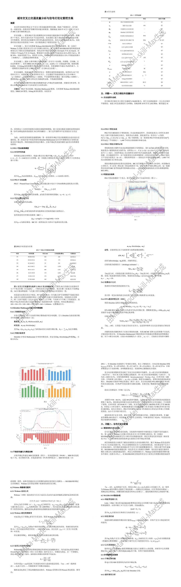

<p align="center">
  
</p>

<h1 align="center">Meta-model-skills-max</h1>

<p align="center">
  <strong>比赛级数学建模自动化SKILL</strong><br>
  <sub>从赛题输入到完整论文交付的全流程自动化系统</sub>
</p>

<p align="center">
  
  
  
  
  
  
</p>

<p align="center">
  <strong>支持 CUMCM · 51MCM · MCM/ICM</strong>
</p>

<p align="center">
  <strong>🔑 API 赞助中转站</strong>：<a href="https://api.scxai.top/"><code>api.scxai.top</code></a>
</p>

<p align="center">
  <a href="#它能做什么">功能能力</a> ·
  <a href="#效果演示claude-code-效果部分展示">效果演示</a> ·
  <a href="#三档深度模式">多种模式</a> ·
  <a href="#快速开始">快速开始</a> ·
  <a href="#项目结构">项目结构</a> ·
  <a href="#常见问题">常见问题</a>
</p>

---

## 它能做什么

**输入赛题与数据 → 输出比赛级论文（含模型、代码、图表、审计报告），全程自动化。**

把一道数学建模赛题变成一篇完整的竞赛论文，覆盖你通常需要 3-4 个人、3 天才能完成的工作：

| 环节 | 能力 |
|------|------|
| **读题解析** | 自动拆解子问题、识别题型、生成符号表、检索相关文献 |
| **数据治理** | 缺失值分析、异常检测、数据字典生成 |
| **模型选择** | 4组候选方案对抗辩论（精度派 vs 稳健派），红蓝对抗裁决 |
| **代码实现** | 自动生成 Python 求解代码，基线对比，实验赛马 |
| **结果验证** | 灵敏度分析、鲁棒性检验、跨子问题一致性校验 |
| **论文撰写** | 结构化论文生成，图表叙事（D-A-C），摘要-正文数字交叉验证 |
| **排版输出** | 一键生成竞赛规范 DOCX（三线表、LaTeX 公式转 Word、宋体/黑体） |
| **质量审稿** | 红队对抗审稿，反 AI 痕迹检测，逐项评分打回 |

### 使用场景

> **强烈建议使用 Claude Code 导入 Skill** — 作者实测效果最好，Claude 的长上下文和指令遵循能力与本项目的多阶段工作流契合度最高。

支持作为 Skill 导入到以下 AI 助手中使用：

| 平台 | 导入方式 | 说明 |
|------|---------|------|
| **Claude Code** | `~/.claude/skills/` 目录导入 | 输入 `/meta-model` 触发 |
| **CodeX** | Skill 配置加载 | OpenAI 官方 AI 助手 |
| **CodeBuddy** | 集成面板一键安装 | 腾讯 AI 编程助手 |
| **Cursor / VS Code** | Agent 配置加载 | IDE 集成模式 |
| **其他 Agent** | 读取 `SKILL.md` 即可 | 通用兼容 |

### 14阶段流水线

```
输入：赛题文档（PDF/Word/TXT）+ 竞赛类型 + 模式（Fast/Standard/Championship）

自动执行：
  ├─ S0：输入登记          → 赛题解析、子问题拆分、数据提取
  ├─ S1：题意解析          → 问题重述、文献检索、技术路线图
  ├─ S2：数据治理          → 数据清洗、特征工程、探索性分析
  ├─ S3：模型选择          → 4组候选方案对抗辩论 + 裁决
  ├─ S4：实验赛马          → 原型代码真实执行 + 基线对比
  ├─ S5：并行建模          → 多子问题独立建模（Q1/Q2/Q3并行）
  ├─ S5.5：模型进化        → 超参优化、集成学习、迁移学习
  ├─ S6：检验灵敏度        → 逐题灵敏度分析 + 鲁棒性检查
  ├─ S7：证据链构建        → 每个数值标注来源（脚本+行号）
  ├─ S7.5：统一内核        → 提炼多模型共同数学框架
  ├─ S8：论文撰写          → 12000+字论文初稿 + 6-10张图表 + AI痕迹扫描
  ├─ S9：对抗审稿          → 三轮红队攻击 + 修订验证 + AI痕迹复检
  ├─ S9.5：出版规范检查    → 34项细则强制审计
  └─ S10：最终构建         → DOCX生成 + 完整性验证

输出：paper.docx（比赛级论文）+ code/（完整代码）+ outputs/（审计报告）
```

### 差异化特性

1. **对抗决策机制** — M002模型辩论会：4组Proposer提案 → Critic红队攻击 → Reviewer独立裁决，避免单人视角盲点
2. **结果冻结与追溯** — S7阶段锁定论文所有关键数值，后续修改代码时自动检测数值漂移
3. **强制基线对比** — 禁止直接使用深度学习/集成模型，必须先实现简单基线
4. **逐题嵌入式检验** — 每个子问题独立执行灵敏度分析+鲁棒性检查+误差分析
5. **反AI痕迹写作** — 40+类AI套话黑名单 + 结构性AI痕迹 + 段落多样性检测，通过2026年反AIGC检测
6. **三轮红队审稿** — 数学视角+领域专家+评审裁判三个独立视角找问题
7. **真实代码执行** — 实验赛马和模型进化从模拟评分改为subprocess真实执行代码
8. **跨子问题一致性** — 自动检测跨子问题的符号冲突、数值不一致、单位矛盾

---

## 效果演示（Claude code 效果，部分展示）

> **提示**：具体效果由多种因素决定，暂时无法保证最终效果。

<p align="center">
  
</p>

---

## 核心架构

```
                   ┌─────────────┐
                   │   主 Agent   │  唯一 LLM，负责编排与推理
                   └────────────┘
                          │
         ┌────────────────┼────────────────┐
         │                │                │
  ┌──────▼──────┐  ┌─────▼─────┐  ┌───────▼───────┐
  │  9角色集群   │  │ 14阶段流水线│  │  32道质量门禁  │
  │              │  │             │  │               │
  │ Chief Agent  │  │ S0 输入登记  │  │ G1 题意解析    │
  │ Planner      │  │ S1 题意解析  │  │ G2 模型选择    │
  │ Analyst      │  │ S2 数据治理  │  │ G3 建模求解    │
  │ Proposer     │  │ S3 模型选择  │  │ G5 论文质量    │
  │ Builder      │  │ S4 实验赛马  │  │ G9 对抗审稿    │
  │ Critic       │  │ S5 并行建模  │  │ ...共32道      │
  │ Reviewer     │  │ ... → S10   │  │               │
  │ Writer       │  └─────────────┘  └───────────────┘
  │ Inspector    │
  └─────────────┘
```

**设计原则：**
- **LLM 是大脑**：所有推理由主 Agent 完成，Python 脚本只做工具性工作（文件读写、画图、DOCX生成、状态追踪）
- **角色制衡**：Planner 规划、Proposer 提案、Critic 攻击、Reviewer 评审——每个决策都有对抗
- **门禁卡死**：每阶段必须通过质量门禁才能进入下一阶段，不通过就打回重做

### 三档深度模式

| 模式 | 适用场景 | 论文质量目标 | 门禁严格度 |
|------|---------|-------------|-----------|
| **Fast** | 时间紧迫 / 练手 | 8000字 / 4图 | 放宽（60分通过） |
| **Standard** | 正式参赛 | 12000字 / 6图 | 标准（70分通过） |
| **Championship** | 冲刺国一 | 15000字 / 10图 | 最严格（85分通过，3轮审稿） |

---

## 快速开始

### 1. 导入 Claude Code Skill

```bash
# 克隆项目
git clone https://github.com/WuXinbo-bo/Math-model-skills.git
cd Math-model-skills

# 安装依赖
conda activate math_model
pip install -r requirements.txt

# 将 skill 安装到 Claude Code
cp -r skills/meta-model ~/.claude/skills/
```

### 2. 调用 Skill

在 Claude Code 中输入：

```
请使用 Meta-model-skills-max skill 处理我上传的数学建模赛题。
竞赛类型：国赛/CUMCM
执行模式：均衡模式（全自动，不打断，无人工干预），这个项目之后默认使用conda activate math_model环境，注意在其中有要求调用子agent的地方默认调用真实的子agent去做相应任务.添加记忆。
```

Claude Code 会自动读取 `SKILL.md`，按 14 阶段流水线引导你完成全流程。

### 3. 环境要求

| 项目 | 要求 |
|------|------|
| **Python 环境** | `conda activate math_model`（默认环境） |
| **子 Agent** | 有要求调用子 Agent 的地方默认调用真实的子 Agent（通过 Task tool） |
| **核心依赖** | `python-docx` `lxml` `pandas` `numpy` `matplotlib` `pyyaml` `scipy` |

### 4. 更多启动场景

| 场景 | 提示词 |
|------|--------|
| 快速模式 | `请使用 Meta-model-skills-max skill 处理赛题，快速模式。` |
| 冲刺国一 | `请使用 Meta-model-skills-max skill 处理赛题，冠军模式。` |
| 只做某题 | `请只求解问题1。` |
| 审计论文 | `请审阅并打分我的论文。` |
| 继续工作 | `请继续之前的建模工作，工作目录是 [路径]。` |

---

## 项目结构

```
Meta-model-skills-max/
├── SKILL.md                    # Skill 入口（路由表 + 执行规则）
├── AGENTS.md                   # 多角色调度策略
├── main.py                     # CLI 统一入口
├── requirements.txt
│
├── stages/                     # 14 个阶段指令文件（S0-S10）
│   ├── S0.md ~ S10.md
│   ├── S5.5.md                 # 模型进化
│   ├── S7.5.md                 # 统一内核归纳
│   └── S9.5.md                 # 出版规范检查
│
├── scripts/                    # 57 个工具脚本（纯工具，无 LLM 调用）
│   ├── stage_executor.py       # 阶段执行状态机
│   ├── gate_contracts.py       # 32 道门禁合约
│   ├── build_docx.py           # DOCX 生成（LaTeX→OMML）
│   ├── pipeline_manager.py     # 流水线管理
│   ├── sensitivity_analysis.py # 灵敏度分析
│   ├── adversarial_review.py   # 红队对抗审稿
│   ├── anti_aigc_scanner.py    # AI痕迹扫描
│   └── ... (50+ more)
│
├── references/                 # 知识资产（450KB）
│   ├── algorithm-library/      # 7 类算法说明
│   ├── modeling-paper-archives/ # 优秀论文范例
│   ├── nature-writing-guide.md # 反AI写作规范
│   └── ... (25+ reference files)
│
├── templates/
│   ├── paper_templates/        # DOCX 模板
│   └── startup_prompts.md      # 11 种启动模板
│
└── config/                     # 工作流与门禁配置
    ├── workflow.yaml
    └── meeting_templates.yaml
```

---

## 支持的竞赛

| 竞赛 | 语言 | 关键格式要求 |
|------|------|-------------|
| **CUMCM** 全国大学生数学建模竞赛 | 中文 | 三线表 / 宋体+黑体 / A4 |
| **51MCM** 五一数学建模竞赛 | 中文 | 三线表 / 宋体+黑体 / A4 |
| **MCM/ICM** 美国大学生数学建模竞赛 | 英文 | 标准学术格式 |

---

## 常见问题

### 1. 是否可以全自动？

**答：** 主要是辅助数学建模，关键环节理论上可以自动化，但建议人工检查。

### 2. 产出质量如何？

**答：** 具体质量由大语言模型能力决定，建议使用 Claude 模型，效果最佳。

### 3. 消耗如何？

**答：** 每篇消耗由题目难度与思考强度有关。参考：冠军模式使用 [api.scxai.top](https://api.scxai.top/) 赞助中转站，大约 **20-40 元/篇**。

### 4. 目前短板

1. **模型质量取决于模型质量**：通过 SKILL 架构来最大化限制流程，确保产出质量。
2. **可能中断**：使用过程理论上全自动，但是可能由于网络或模型思考自动中断，回复"继续使用 Meta-model-skills-max 技能完成后续阶段"即可。
3. **排版微调**：目前暂时无法确保最终产出的排版完全正确，可能需要人工二次微调。
4. **图表质量**：图表质量暂时无法保证。

---

## 建议反馈

欢迎提出建议与反馈，可通过 QQ（1806598228）联系，也可申请 pull requests，感谢你的支持与贡献。

---

## 许可证

MIT License

## 致谢

本项目站在巨人的肩膀上：

- [math-modeling-skills-main](https://github.com) (v5.9.0)：工业级稳健性基础
